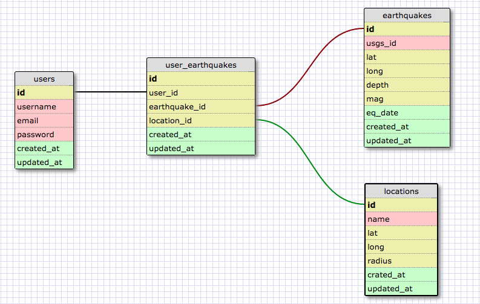

# Earthquake Map App Unleashed

This web application is a passion project developed for Dev Bootcamp SF. The MVP of this app will allow users to request earthquake catalogs from the U.S. NEIC and to plot and view these in Google Maps.

Upon reaching MVP, 3-D plotting and viewing of selected catalogs will be implemented.

**Database Schema**
